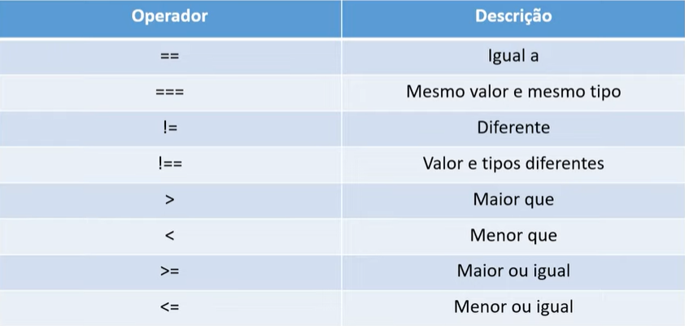

# Operadores JS

O Javascript possui diversos operadores para manipulaçao de dados, esse resumo foi feito durante a aula de Operadores JS da DIO.me.

## Operadores de Atribuição


## Operadores de Aritimética


## Operadores de Comparação



## Operadores Logicos


## Operador condicional ( Operador Ternario )

```
(Condicional) ? (expressao1) : (expressao2)
```

Temos uma condiçao seguida de `?` tendo o codigo a ser executado caso seja verdadeiro separado por `:` do codigo que sera executado caso seja falso.
Ex:

Voce pode encontrar o codigo de exemplo no arquivo OperadorTernario.js nessa pasta