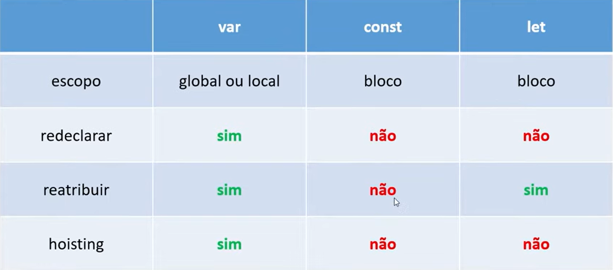

# Variaveis e Constantes

De forma simplificada criamos variaves e constantes para armazenar valores durante a execuçao de nossa aplicaçao.
Atribuimos valores a variaveis e constantes utilizando o operador de atribuiçao =

## Variaveis

Sao valores mutaveis, ou seja a definirmos uma variavel podemos alterar o valor interno a mesma , em javascript como nao temos uma tipagem forte usualmente podemos mudar tambem o tipo de uma variavel, mas isso nao é muito recomendado por boas praticas.

Ex temos uma variavel `nomeCompleto = "Luis Felipe"` e podemos mudar ela para `nomeCompleto="Luis Felipe de Paula Costa"`(isso seria o correto pela variavel se chamar nomeCompleto mas leve apenas como exemplo) ou para `nomeCompleto="fulano de tal"` ...( em javascript podemos inclusiva mudar `nomeCompleto=2`)

### var

Declarar uma variavel utilizando var , define o escopo da mesma de forma global ou seja ela nao esta apenas dentro do escopo de codigo que a criamos ( exemplo dentro de um if, se criarmos uma var , podemos acessar de forma externa ao if, isso pode causar diversos problemas com nomes de variaveis repetidas pelo codigo )
Var tambem possui hoisting ou seja ao executar o codigo o JS carrega sua declaraçao no topo do arquivo. ( nao sua atribuição )

declaramos var:

```
var numero = 2; // declaramos uma var numero e atribuimos o valor 2

if (numero === 2) {
  var numeroDentroDoIf = 4; // essa variavel pode ser acessada de fora do bloco if no caso
  console.log(numeroDentroDoIf); // ira retornar 4
}

console.log(numeroDentroDoIf); // ira retornar 4

```

### let

Ja ao utilizarmos let definimos uma variavel de escopo ou seja ela so existe dentro do escopo definido ( seguindo o mesmo exemplo do if se definirmos com let dentro, ela nao ira existir fora do if ).
Nao possui Hoisting.

```
var numero = 2;

if (numero === 2) {
  let numeroDentroDoIf = 4; // essa variavel pode ser acessada de fora do bloco if no caso
  console.log(numeroDentroDoIf); // ira retornar 4
}

console.log(numeroDentroDoIf); // ira retornar undefined (numeroDentroDoIf is not defined)

```

## Constantes

Constantes armazenam os dados de forma fixa nao permitindo que a mesma tenha seu valor/tipo base alterados. Constantes nao permitem reatribuição.

```
const numero = 1; // se seguirmos a convençao de usar Upper Case Snake Case o correto seria nomear ela como NUMERO mas falaremos sobre isso depois.

numero = 2; // ira dar erro no codigo por tentarmos atribuir outro valor a uma variavel constante
// Error: Assignment to constant variable.

console.log(numero); // nem chegara a ser executado

```

### const

Criamos constantes utilizando `const nomeDaConstante;` ex: `const nomeCompleto = "Luis Felipe"` nesse caso criamos uma constante nomeCompleto e atribuimos o valor "Luis Felipe" ( uma string/texto )
Nao possui Hoisting.


## Resumo Var Let Const

Resumo tirado do curso de Variaveis e Tipos da DIO.me



## Nomeclaturas

Ao nomear uma variaveis podemos seguir alguns padroes
Vamos usar de exemplo uma String(texto) (falaremos de tipos depois) com o conteudo de um nome completo, podemos nomear a variavel/constante

### Camel Case ( padrao mais comum para nomear variaveis e constantes )

nomeCompleto (primeira palavra começa com minusculo e as seguintes(se tiver) começam junto com letra maiscula)

### snake Case

nome_completo (palavras separadas por _ )

### Kebab Case

nome-completo ( palavras separadas por -)

### Pascal Case (mais comum para nomear nome de arquivos com classes ...)

NomeCompleto ( palavras sempre começam com letra maiuscula )

### Upper Case Snake Case ( em algumas convençoes utilizadas para constantes, usualmente em variaveis de ambiente )

NOME_COMPLETO (todas as letras maisculas com palavras separadas por _ )
